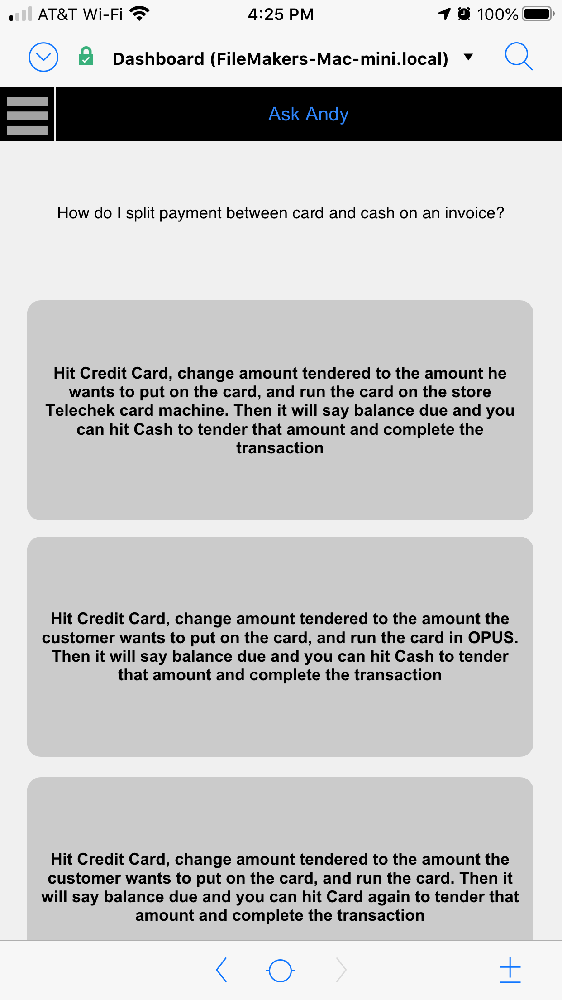
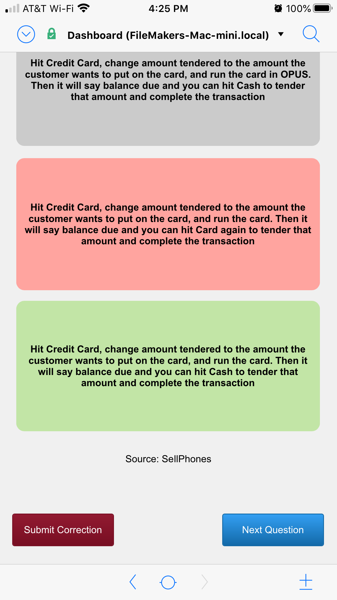
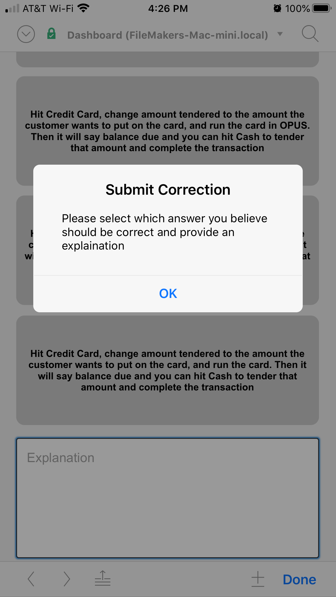
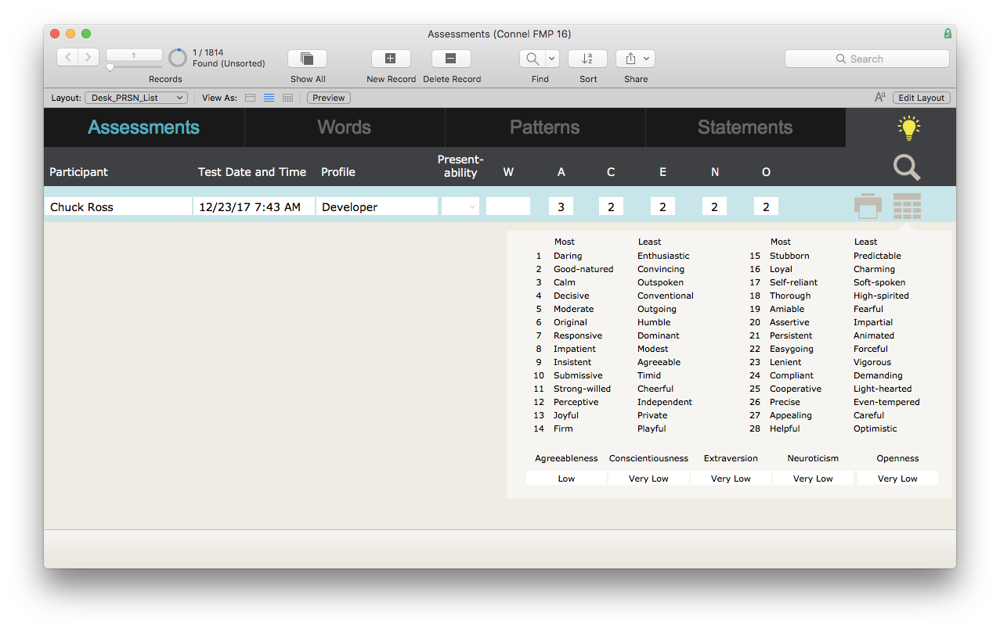
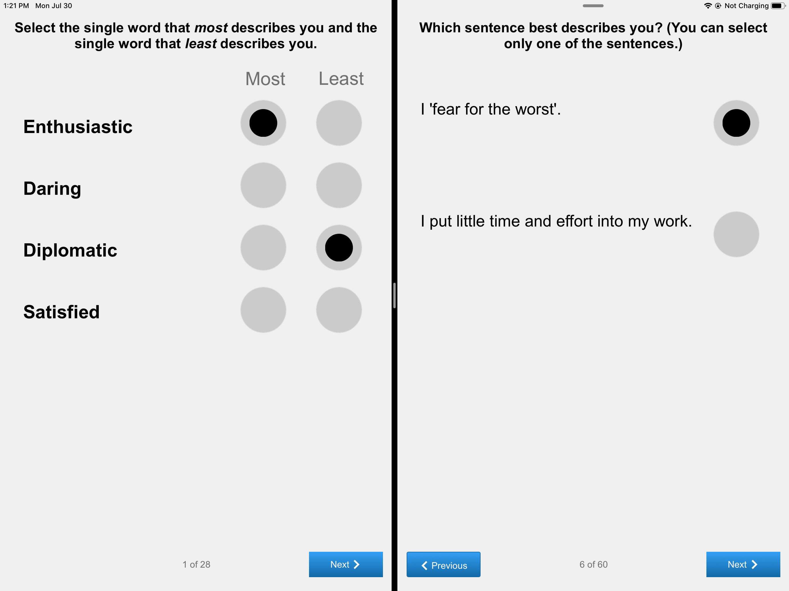
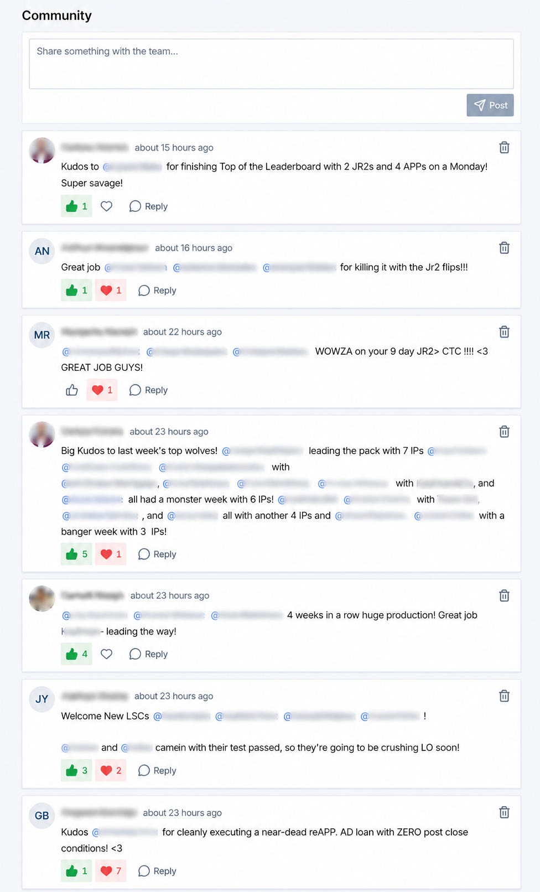

# Project Evidence

Selected screenshots from shipped client applications.

<!-- markdownlint-disable MD033 -->

## Ask Andy

Knowledge-assistance app used on phones by frontline staff. The workflow presents candidate answers, captures corrections, and improves guidance over time.

- [Mobile knowledge workflow](ask-andy-img-3995.png): answer selection interface for real operational questions.

  

- [Correction feedback flow](ask-andy-img-3996.png): user submits correction when a selected answer is wrong.

  

- [Post-response workflow](ask-andy-img-3998.png): follow-up state after response and correction handling.

  

## Assessments

HR personality assessment tool used to evaluate role fit for sales positions across desktop and tablet interfaces.

- [macOS dashboard and scoring](assessments-macos.png): assessment results, dimensions, and scoring layout.

  

- [iPad assessment UX](assessments-ipad-assessment.png): guided assessment flow for tablet users.

  

## Brokerage CRM

Custom modules built for an actively operating mortgage brokerage running a full-stack React/Node.js CRM.

- [Community chat feed](brokerage-community-chat.png): employee-wide recognition and announcements channel with reactions and threaded replies.

  

<!-- markdownlint-enable MD033 -->
